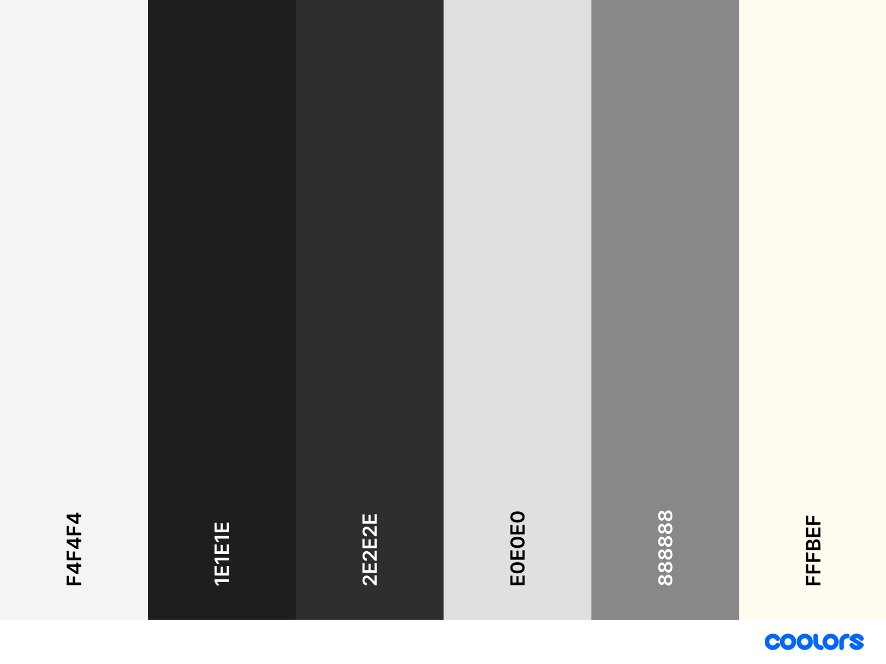

# Màquina arcade bartop - Projecto final

Alejandro Yuste Ponces

## Objectius

El objetivo principal será crear una máquina arcade de tipo "bartop" por un precio que todo el mundo podría permitir-se hacer una
Fases y tareas del proyecto bartop

1. Diseño
   Diseño del mueble (medidas, planos)
   Diseño del arte gráfico (vinilos, side art...)
   Diseño de distribución interna (pantalla, mando, raspberry pi)

2. Compra de materiales
   Pantalla (monitor o tablet adaptada)
   Raspberry Pi
   Botones arcade y joystick
   Cables y conectores
3. Construcción del mueble
   Impresión de las piezas
   Montaje
   Lijado y ajuste
   Pintura / preparación para vinilos
4. Electrónica
   Instalación de pantalla
   Montaje de botones y joystick
   Cableado del panel de control
   Alimentación eléctrica
5. Software
   Instalación de sistema (RetroPie / Batocera)
   Configuración de emuladores
   Configuración de mandos
   Carga de juegos (ROMs)
6. Integración
   Montaje final de componentes
   Organización del cableado interno
   Ajustes de ventilación
7. Pruebas
   Test de controles
   Test de audio y vídeo
   Ajustes de software
   Corrección de errores
8. Acabado
   Colocación de vinilos
   Limpieza final y ajustes estéticos
9. Funcionamiento correcto
   Se puede jugar a las roms anteriormente introducidas
   los controles funcionan bien
   el Sistema Operativo funciona

# Creación web
Para crear la web, utilicé los siguientes recursos:
1. realfavicongenerator, para crear el icono de la web junto con canva
 https://realfavicongenerator.net/your-favicon-is-ready
2. coolors, para crear una paleta de colores a utilizar durante la creación de la web
   https://coolors.co/fff8ef-1f2937-8ab7ff-e5e7eb-10b981

   Colores a utilizar:
   Floral White: #FFF8EF (fondo general)
   Jet Black: #1F2937 (fondos)
   Baby blue ice #8AB7FF (Aún no lo sé)
   Platinum #E5E7EB (textos)
   Mint leaf #10B981 (acentuar)

   