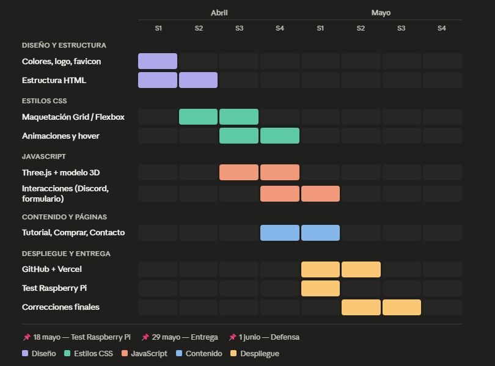

# Mini Bartop Project - Memoria del Proyecto Final

## 1. Integrantes del proyecto
**Alejandro Yuste Ponces**

---

## 2. Título
Mini Bartop Project — Crea tu propia arcade bartop

---

## 3. Objetivos
El objetivo principal es construir una máquina arcade bartop a un precio asequible (alrededor de 70 €) para que cualquier persona pueda tener una en casa.

- Diseñar dos modelos de carcasa 3D (Lapcade y Bartop).
- Configurar una Raspberry Pi con el sistema Batocera para jugar a ROMs.
- Crear un sitio web que explique el proyecto y permita comprar los componentes.
- Desplegar el sitio web en un servidor Github pages.

---

## 4. Explicación del proyecto
El proyecto nace de la idea de hacer accesibles las máquinas arcade. En vez de comprar una cara, se propone fabricarla uno mismo con una impresora 3D y una Raspberry Pi.

Se han diseñado dos modelos:

- **Lapcade**: versión pequeña y portátil, más barata y fácil de montar.
- **Arcade Bartop**: versión grande y estética, con el aspecto clásico de una arcade.

El sitio web tiene las siguientes páginas:
- **Inicio** — presentación con modelo 3D animado
- **Proyecto** — explicación de los modelos
- **Tutorial** — guía paso a paso para montar la consola
- **Componentes** — lista de piezas necesarias
- **Comprar** — tres packs de compra
- **Contacto** — formulario y redes sociales

---

## 5. Material del proyecto

**Hardware:**
- Raspberry Pi 0 2W
- Micro SD 32 GB
- Pantalla LCD 7"
- Mando arcade USB (joystick y botones)
- Adaptadores OTG y HDMI
- Cable de alimentación 5V 2A
- Carcasa impresa en 3D

**Software:**
- HTML, CSS y JavaScript — construcción del sitio web
- Three.js — modelo 3D animado en la web
- Batocera Linux — sistema operativo de la consola
- Raspberry Pi Imager — para instalar el sistema en la SD
- Tinkercad — diseño de las carcasas en 3D
- GitHub — repositorio del código
- Vercel — despliegue del sitio web

---

## 6. Desarrollo y despliegue

El sitio web se ha hecho con HTML, CSS y JavaScript puros, sin ningún framework.

La parte más compleja es la página de inicio, donde se usa **Three.js** para mostrar un modelo 3D de la máquina que rota solo y flota. También hay un efecto de luz azul que sigue el cursor del ratón.

El resto de páginas siguen la misma estructura: header fijo, contenido central y footer común con redes sociales.

El sitio web se ha desplegado en Github.

El servidor con **Raspberry Pi** se configuró y probó el 18 de mayo.

---

## 7. Planificación

**Sprint 1** — Diseño: colores, logotipo, favicon y estructura HTML básica.

**Sprint 2** — Estilos: CSS completo, maquetación con Grid y Flexbox, animaciones.

**Sprint 3** — JavaScript: modelo 3D con Three.js, efecto de luz, copia de Discord.

**Sprint 4** — Contenido: tutorial, página de compra, página de contacto.

**Sprint 5** — Despliegue: GitHub, Vercel, test en Raspberry Pi y correcciones finales.

*Diagrama de Gantt*

---

## 8. Webgrafía

- Three.js: https://threejs.org/
- Batocera Linux: https://batocera.org/
- Raspberry Pi Imager: https://www.raspberrypi.com/software/
- Tinkercad: https://www.tinkercad.com/
- Simple Icons (iconos SVG): https://simpleicons.org/
- Coolors (paleta de colores): https://coolors.co/
- Google Fonts (Inter Tight): https://fonts.google.com/
- UIverse (botones CSS): https://uiverse.io/buttons
- Vercel: https://vercel.com/
- GitHub del proyecto: https://github.com/Ayuste07

---

## 9. Anexos

**Packs de venta:**

| Pack | Precio | Incluye |
|---|---|---|
| Básico | 60 € | Raspberry Pi, Micro SD, adaptadores, cable |
| Lapcade | 80 € | Pack Básico + pantalla + carcasa Lapcade + mando |
| Bartop | 120 € | Pack Básico + pantalla + carcasa Bartop + mando pro |

**Fechas importantes:**

| Fecha | Evento |
|---|---|
| 18 de mayo | Test de despliegue en Raspberry |
| 29 de mayo | Fecha límite de entrega |
| 1 de junio | Defensa del proyecto |
